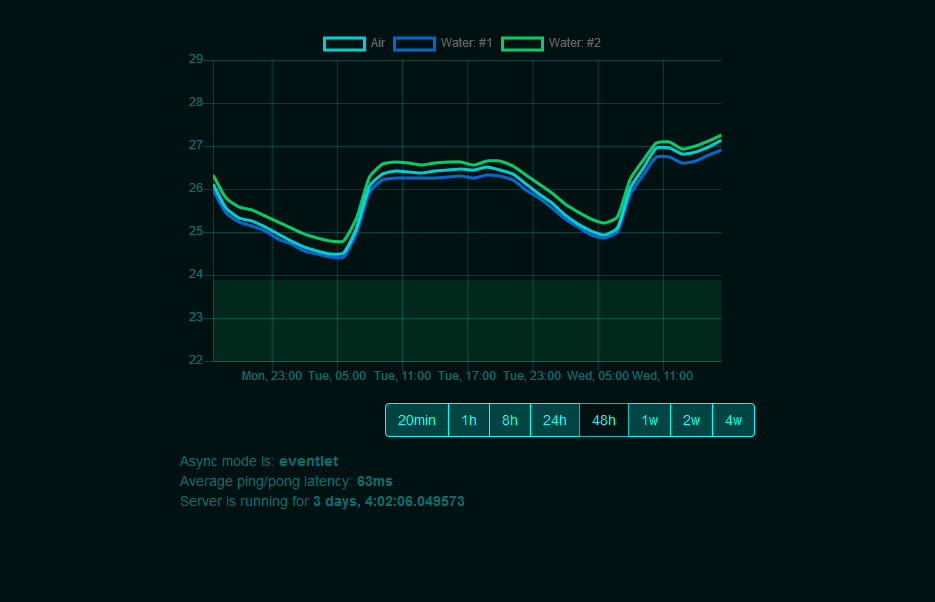

# Temperature Monitor
Simple Raspberry Pi web server thermometer:

Uses:
- Raspberry Pi as a hardware platform
- ds18b20 temperature sensors
- rrdtool as a real time database
- Flask as a web framework
- Ansible for repeatable-one-click deployments

Other nice things:
- production database is stored in mounted RAM disk to avoid every 5s write operations into SD card - every hour is backed up!

